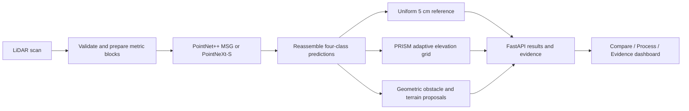

# PRISM

### Adaptive Variable-Resolution 2.5D LiDAR Mapping

**Fine detail near the vehicle. Compact representation farther out.**

Smart India Hackathon 2026 | **SIH26053** | Team **PERCEPTRONS11** | Team ID **163272**

[Open the AWS prototype](https://d32vayd84aynlf.cloudfront.net/) · [Reviewer walkthrough](docs/evaluator-guide.md) · [Run locally](docs/quickstart.md) · [Measured evidence](docs/evidence.md)

PRISM turns LiDAR scans into a map of terrain, obstacles and measured surface heights. Two trained point-cloud models provide semantic predictions. An adaptive grid keeps small cells nearby and allocates larger cells farther away, with extra refinement where height or semantic composition changes.

This is a **working research prototype**, with trained checkpoints, an interactive dashboard and reproducible evaluation code. It has not achieved real-time vehicle operation or completed field safety validation.

> **Public demo:** recorded GPU results are available immediately. Fresh uploads run genuine inference on an AWS CPU server and may take several minutes. Recorded playback is labelled separately from new processing. The hosted limits are 64 MB and 16 frames per upload job.

## Start with the evidence

These experiments answer different questions. Their results should be read separately.

| Question | Measured result | Evaluation scope |
|---|---|---|
| Can the models segment LiDAR? | PointNet++ MSG **79.00%**, epoch 48. PointNeXt-S **78.40%**, epoch 21. | Four-class validation **block mIoU**, 600 sequence-08 blocks. Selected checkpoints, not independent test results. |
| Does the grid retain near-field agreement? | **80.935% common-cell mIoU** for both uniform and PRISM. | 256 sequence-08 validation scans, PointNet++ epoch 48. |
| Does it reduce map allocation? | **5.45% fewer occupied leaves**, 60,501 to 57,205. Leaf storage **2.423 to 2.291 MiB**. | Same 256-scan grid report. |
| Does pre-inference sampling reduce work? | **386,944 to 179,968 network input points**. Throughput **1.237 to 1.914 frames/s**. | Separate controlled 32-scan profile. mIoU **81.04% to 80.47%**, a 0.57 percentage-point trade-off. |
| What does the complete backend cost? | **1,392 ms median result latency** on RTX 2060 SUPER. | 32 scans, epoch 48. Includes both grids, proposals and JSON serialization. Excludes disk, HTTP and browser drawing. |

Adaptive grid construction itself was **slower** than uniform binning in the grid report, 78.01 ms versus 46.29 ms. The sampling throughput gain above is a separate experiment and does not establish a faster full backend.

[Evidence definitions and source files](docs/evidence.md)

## What reviewers can explore

- **Compare:** inspect the uniform 5 cm reference and PRISM on the same recorded scans.
- **Process:** replay saved results, select a model, or run fresh inference on supported point-cloud inputs.
- **Evidence:** inspect distance-band results, policy comparisons, failure cases and checkpoint provenance.
- Change the focus heading to rebuild grid allocation. Inspect semantic confidence, elevation variation and observed coverage.
- Download TorchScript bundles for compatible PyTorch runtimes. These are model exports, not verified edge-device deployments.

[A five-minute review path](docs/evaluator-guide.md)

## System design



Each adaptive leaf stores horizontal bounds, semantic votes, confidence, point count and height statistics. Nominal distance ceilings are **5, 10, 25 and 50 cm** across **0–10, 10–25, 25–60 and 60–100 m**. A protected 3 m core uses 5 cm cells. Heading and local refinement influence the resulting allocation.

The four classes are **drivable terrain**, **non-drivable terrain**, **static obstacles** and **dynamic-object semantics**. The final group includes vehicle/person categories. It does not establish that an object is moving. Boxes are geometric proposals rather than learned detection or tracking outputs.

[Architecture and code entry points](docs/architecture.md) · [Detailed implementation guide](docs/technical-guide.md)

## Repository map

```text
backend/
  api/                 FastAPI routes and model downloads
  application/         Pipeline, fusion, comparison and evidence services
  ingest/              Scan readers, validation and background jobs
  model/               PointNet++, PointNeXt-S, training and checkpoints
  grid_engine/         Adaptive leaves, fovea and refinement rules
  detection/           Geometric obstacle and terrain proposals
  eval/                Model, grid and runtime evaluation
frontend/
  assets/app/          Viewer and dashboard coordination
  assets/features/     Comparison, processing and evidence interfaces
  assets/styles/       Dashboard styling
data/                  Evidence, recorded frames and artifact manifests
docs/                  Setup, architecture, reviewer guide and reports
deployment/aws/        GPU ECS deployment template
scripts/               Preparation, evaluation, exports and diagnostics
tests/                 API, model, mapping and evidence checks
```

Full datasets, training caches, generated exports and uploaded jobs are excluded from Git. Best-validation checkpoints and recorded evidence are retained. See [artifact policy](docs/artifacts.md).

## Run and reproduce

[Local setup](docs/quickstart.md) includes environment creation, CPU/CUDA guidance, dataset expectations and export commands. Training used **NVIDIA RTX 2060 SUPER**, 20,000 prepared training blocks and 600 validation blocks. SemanticKITTI sequences **00–07, 09 and 10** supply training data. Sequence **08** supplies validation and checkpoint selection.

Selected checkpoint epochs describe the retained weights. They do not imply each model was trained in one uninterrupted run.

## Deployment status

The public prototype runs the FastAPI application on **AWS EC2 CPU**, with **CloudFront HTTPS** and private **S3 recovery archives**. Saved GPU benchmarks remain distinct from hosted CPU processing. [Hosting overview](docs/hosting.md)

The CUDA Dockerfile and ECS GPU template are preparation artifacts. They are not the configuration of the current CPU deployment or evidence of a GPU cloud performance result.

## Research and attribution

SemanticKITTI supplies the labelled data. PointNet++ and PointNeXt inform the segmentation architectures. Adaptive-grid literature informs selective spatial refinement. Research references and their implementation scope are documented in the [technical guide](docs/technical-guide.md#research-basis). Paper results are not PRISM benchmark results.

Third-party source notices remain with their implementations. Dataset and model permissions require separate review before redistribution. No blanket license is assigned to all repository assets.

## Next engineering steps

1. Reduce full backend latency and measure it on the intended deployment hardware.
2. Improve far-range semantic recall and validate on additional environments.
3. Train and evaluate temporal motion estimation before claiming tracking.
4. Validate exported models on specific edge hardware and conduct a vehicle pilot.

[Contribution guide](CONTRIBUTING.md) · [Security and public-demo scope](SECURITY.md)
