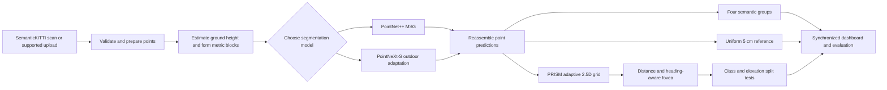

# PRISM

## Adaptive Variable-Resolution 2.5D LiDAR Mapping for Dynamic Environment Perception

**Smart India Hackathon 2026**<br>
**Problem statement:** SIH26053  ·  **Team ID:** 163272  ·  **Team:** PERCEPTRONS11

PRISM turns a 3D LiDAR scan into a semantic elevation map that keeps fine spatial detail close to the sensor and uses larger cells farther away. Its aim is to retain useful surface height and terrain meaning while reducing the amount of map data carried across less detailed regions.

This repository contains the working prototype, two trained segmentation architectures, the adaptive grid engine, evaluation evidence, and a single-page dashboard for inspecting the complete path. The current measured system is an **offline / near-real-time demonstrator**. It does not meet a real-time autonomous driving deadline, and this README reports its measured trade-offs instead of implying otherwise.

> **At a glance:** sequence-08 validation · 3,839 paired training scans · 20,000 prepared training blocks · two selectable models · locally replayable scan results · measured cell-level and runtime evidence.

## Contents

- [The problem and PRISM’s approach](#the-problem-and-prisms-approach)
- [How a scan becomes a map](#how-a-scan-becomes-a-map)
- [What has been measured](#what-has-been-measured)
- [Dashboard walkthrough](#dashboard-walkthrough)
- [Run the prototype](#run-the-prototype)
- [Train or compare the models](#train-or-compare-the-models)
- [Codebase map](#codebase-map)
- [Data, models, and deployment](#data-models-and-deployment)
- [Research basis](#research-basis)
- [Current scope and next work](#current-scope-and-next-work)

## The problem and PRISM’s approach

Autonomous navigation needs a representation that is detailed enough to describe nearby terrain and obstacles without spending the same memory and computation on every point in a 360-degree scan. A flat 2D map can hide height changes. A dense 3D grid preserves height, but allocates many cells in empty or visually simple space.

PRISM combines learned point classification with an adaptive 2.5D surface map:

1. A point-cloud network assigns each LiDAR return to one of four broad semantic groups.
2. The grid engine projects those predictions into leaves that retain horizontal bounds, height statistics, class votes, confidence, and point count.
3. The sensor’s nearby region keeps fine cells. More distant areas receive coarser resolution ceilings, while locally complex regions can be refined.
4. The dashboard compares the adaptive map with a uniform reference on the same frames and exposes the measurements behind the visualization.

The intended benefit is **selective detail**: preserve near-field map agreement and measured elevation structure, while using fewer occupied map leaves overall. The present evidence shows a modest storage benefit and a measurable grid-construction cost. It does not show that the adaptive grid is faster than uniform binning.

## How a scan becomes a map



### 1. Input and preparation

The local API accepts SemanticKITTI presets and supported `.bin`, `.ply`, `.pcd`, and `.zip` point-cloud inputs. Uploads are capped at 500 MB and processing is capped at 300 frames. The parser checks supported format, point layout, finite values, and sequence bounds before a job starts. Jobs run in the background, publish completed frames progressively, and cache results for smooth replay. Replay does not run inference again.

Each scan is prepared in 10 m × 10 m metric blocks. A fast plane fit supplies height above ground. The model uses six channels: local x, y, z, intensity, height above ground, and a motion-residual input. The residual is zero when temporal pose data or a compatible trained residual model is unavailable. Predictions are reassembled into scan coordinates before grid construction.

### 2. Semantic segmentation

The dashboard can select either of two trained models for new runs:

| Model | Role in PRISM |
|---|---|
| **PointNet++ MSG** | Multi-scale set-abstraction and feature-propagation network used as the primary architecture. |
| **PointNeXt-S** | A second point-cloud architecture adapted to the same LiDAR features, class mapping, and scan workflow for a same-input comparison. |

The output is derived from SemanticKITTI’s own label configuration and grouped into four classes: **drivable**, **non-drivable terrain**, **static obstacle**, and **dynamic-object semantics**. In this prototype, “dynamic-object” describes a vehicle/person semantic group. It does not prove that an object is moving, assign a persistent identity, or measure its speed. Displayed boxes are geometric proposals around predicted points.

### 3. Adaptive 2.5D mapping

The map is stored as variable-size leaves in an N-dimensional subdivision tree. A leaf retains its XY extent and surface measurements instead of expanding every region into the finest lattice. PRISM applies three constraints in order:

| Layer | Current policy | Why it exists |
|---|---|---|
| Safety floor | Within 3 m of the sensor, use 5 cm cells and do not merge them into larger cells. | Preserve the closest region at the finest configured resolution. |
| Distance and heading | Resolution ceilings are 5 cm at 0–10 m, 10 cm at 10–25 m, 25 cm at 25–60 m, and 50 cm at 60–100 m. Speed and heading shape the forward attention field. | Spend fewer cells at range while keeping the high-detail region aligned with travel direction. |
| Local refinement | Split when semantic composition or elevation variation is not sufficiently uniform. Larger samples use a categorical test; small samples fall back to normalized class entropy. | Recover detail where the observed scene is more complex than its distance band suggests. |

The heading control is passed through the browser and API into the grid build, so it affects backend allocation as well as the drawn focus field. Boundaries are blended to avoid abrupt visual seams.

This is a **2.5D surface representation**, not a full multi-layer 3D scene. It stores measured height statistics for represented surfaces but cannot guarantee correct interpretation of stacked surfaces or overhang clearance. Elevation error in the report is measured against a scan-derived 5 cm reference, not surveyed road truth.

### 4. Jobs, replay, and evidence

The API validates inputs, selects a model, serializes inference work through one local worker, and stores frame results under `data/jobs/`. The browser progressively displays finished frames. Each replay preserves the model and checkpoint identity that produced it. Processing throughput, cached playback speed, grid-only latency, serialization time, and browser drawing time are distinct quantities in the UI and reports.

The comparison and evidence views include synchronized raw, semantic, dense local reference, and adaptive map views; distance-band quality; five grid policies; uncertainty and observed/unobserved views; challenge examples; cell allocation; runtime distributions; and checkpoint provenance. Display limits used for drawing are separated from counts used in metrics.

## What has been measured

The results below describe different experiments and must not be combined as if they came from one benchmark. Full per-frame values, checkpoint hashes, hardware, definitions, and exclusions are recorded in [`docs/reports/finalist-evidence.md`](docs/reports/finalist-evidence.md), [`docs/reports/performance.md`](docs/reports/performance.md), and the corresponding JSON evidence files.

### Grid-level comparison

The current cell-level report evaluates **256 of 4,071 sequence-08 scans** using the PointNet++ epoch-48 checkpoint on an NVIDIA RTX 2060 SUPER. Sequence 08 is the validation sequence used for checkpoint selection; it is not an independent test set.

| Measure | Uniform 5 cm | PRISM | What it means |
|---|---:|---:|---|
| Near common-cell mIoU | 80.935% | 80.935% | Agreement on shared occupied 5 cm reference cells is tied in this sample. |
| Occupied map leaves | 60,501 | 57,205 | PRISM uses 5.45% fewer occupied leaves. |
| Leaf storage | 2.423 MiB | 2.291 MiB | A modest 0.132 MiB reduction for the measured scan. |
| Grid construction time | 46.29 ms | 78.01 ms | PRISM takes 31.72 ms longer for this grid build. |

These measurements support a **small storage reduction at matched near-field agreement**, with a grid-construction cost. They do not support a blanket “faster and smaller” claim. Dynamic-object semantic recall in the same evidence is 92.95% at 0–10 m and 14.73% at 60–100 m. Far-range recall remains an important limitation.

### Model validation and runtime

| Evidence | Result | Scope |
|---|---:|---|
| PointNet++ best validation block mIoU | 79.00%, epoch 48 | 20,000 training blocks and 600 sequence-08 validation blocks. This is a block-level validation score. |
| PointNeXt-S best validation block mIoU | 78.40%, epoch 21 | Same prepared training/validation block counts. This is also block-level validation, not an independent test score. |
| Full backend result latency | P50 1,392 ms · P95 1,905 ms · P99 1,918 ms | 32 spread sequence-08 validation scans, PointNet++ epoch 48. Includes model processing, both display grids, object/terrain proposals, and JSON serialization. Disk, HTTP, and browser rendering are excluded. |
| Cold first result | 2,760 ms | Includes 447 ms to load the checkpoint. |
| Peak process RSS / GPU allocation | 1,403 MiB / 524 MiB | Maximum observed in the 32-scan runtime sample. |

The current full path is about **0.72 completed results per second at the median**, not 30 FPS. Smooth replay is from cached frames and does not imply real-time inference. The broader 512-scan report is an epoch-30 historical run; it is retained as historical evidence and is not presented as current-checkpoint runtime.

### Controlled pre-inference point reduction

A separate controlled profile tested a far-block sample reduction. It reduced average model input from **386,944 to 179,968 points per scan** and measured model-plus-grid throughput from **1.24 to 1.91 frames/s**, with mIoU changing from 81.04% to 80.47% in that profile. This experiment has its own checkpoint and scope, excludes detection and rendering, and is not the current full-pipeline benchmark. See the performance report before comparing it with the grid table above.

### Evaluation rules

- Sequence 08 is kept out of gradient training and used for validation and checkpoint selection. It is not called an untouched test set.
- Sequence 11 contains runtime-only scans because its official labels are private. It is not used for labeled accuracy claims.
- A cell’s reference label is formed from SemanticKITTI points under the report’s stated majority-label rule. The report distinguishes each-leaf scoring from shared 5 cm common-cell scoring.
- Elevation error is a projection/compression error against scan-derived reference cells, not surveyed terrain accuracy. Occupancy scores do not count unobserved space as free.
- Confidence intervals and temporal comparisons are defined in the report; the sequence-08 sample does not establish independent-sequence generalization.

## Dashboard walkthrough

The dashboard is one page with fixed section navigation:

1. **Compare maps:** inspect uniform versus adaptive mapping on synchronized scans and compare cell quality, leaf count, storage, and grid time.
2. **Compare models:** select PointNet++ or PointNeXt-S for new scans, review same-input results, and download available model bundles.
3. **Process a scan:** choose a preset or upload a supported sequence, follow progressive processing, inspect the result, and replay cached frames.
4. **Evidence:** open distance-band metrics, policy ablations, failure examples, runtime distributions, and provenance.

The interface is designed to make the central engineering question easy to inspect: **what map detail is retained, how much allocation changes, and what time that costs?** It presents class labels as semantics rather than tracking and keeps processing time separate from replay smoothness.

## Run the prototype

### Requirements

- Windows with PowerShell or a compatible Python environment.
- Python dependencies listed in `requirements-model.txt`.
- A PyTorch build appropriate for the available hardware. CUDA is used when available; CPU inference is supported but slower.
- To run training or the full SemanticKITTI presets, obtain SemanticKITTI through its official distribution and place sequences and `semantic-kitti.yaml` in the expected `data/dataset/` layout. Dataset files are excluded from this repository because of their size and distribution terms.

### Start locally

Create the Python environment and install project requirements plus a PyTorch build appropriate for your machine. Then run:

```powershell
python -m pip install -r requirements-model.txt
.\start.ps1
```

Open [http://127.0.0.1:8000/README](http://127.0.0.1:8000/README). The launcher runs a preflight check before starting the API. The application itself uses local assets and does not require a cloud account, message broker, remote chart library, or network service once dependencies and data are present.

### Useful local checks

```powershell
python -m pytest -q
python scripts/doctor.py
```

`data/pointnet_frames/` and `data/pointnet_demo.json` provide the bundled validation demonstration. Full SemanticKITTI presets and training require the separately obtained dataset.

## Train or compare the models

Training resumes from the best validation checkpoint when present. It uses mixed precision on CUDA, probes a stable batch size, checkpoints each epoch, and retains the best validation mIoU checkpoint. Training time is bounded; a short fine-tune does not guarantee convergence.

```powershell
.\train.ps1 -Architecture pointnet2 -Minutes 30
.\train.ps1 -Architecture pointnext_s -Minutes 30
```

The trainer writes epoch history and updates each architecture’s `best.ckpt` only when validation improves. It uses the prepared block cache under `data/blocks_cache_expanded/`. Review `data/training_run.json`, `data/models/pointnext_s/training_run.json`, and the CSV logs when reporting training details.

Compare both models on the same available validation scans:

```powershell
python scripts/compare_models.py --frames 32
```

Export deployment bundles after a checkpoint update:

```powershell
python scripts/export_deployment.py --architecture all
```

The export script creates fixed-shape TorchScript bundles with model/checkpoint metadata, class and input-feature contracts, attribution, and parity evidence. Those generated bundles are local release artifacts and are not committed to GitHub; the best-validation checkpoint weights are committed. After cloning, run the export command below to enable the model download buttons. The bundles are model handoffs for compatible PyTorch runtimes. They are not standalone scan-to-map applications and do not certify latency on Jetson, TensorRT, or any other target device.

## Codebase map

The repository is organized by responsibility so an evaluator can trace a scan from its API boundary through model inference and grid construction to the measurements shown in the dashboard.

| Location | Responsibility |
|---|---|
| `backend/api/` | FastAPI routes, model selection, upload/job endpoints, health checks, and model downloads. `server.py` is the ASGI application. |
| `backend/application/` | End-to-end scan pipeline, scene fusion, model comparison, and evidence services. |
| `backend/ingest/` | Input format validation, point-cloud loading, and background upload jobs. |
| `backend/model/` | Feature preparation, inference, training, checkpoint registry, and model implementations. |
| `backend/model/pointnet2/` | PointNet++ set-abstraction, feature propagation, and segmentation network. |
| `backend/model/pointnext/` | PointNeXt-S outdoor adaptation. |
| `backend/grid_engine/` | Fovea and distance policies, subdivision tests, elevation fusion, and adaptive leaf construction. `ndtree.py` is the central grid implementation. |
| `backend/detection/` | Per-class geometric clusters, boxes, and terrain/curb proposals. These are not learned object tracking. |
| `backend/localization/`, `backend/planning/` | Odometry transforms and occupancy-planning helpers. |
| `backend/eval/` | Grid, model, runtime, and ablation evaluation runners. |
| `backend/infrastructure/` | Shared filesystem and runtime paths. |
| `frontend/index.html` | Single-page dashboard structure. |
| `frontend/assets/app/` | Dashboard startup, viewer, controls, and page coordination. |
| `frontend/assets/features/` | Comparison, evidence, model selection, presentation, and scan-processing features. |
| `frontend/assets/styles/` | Layout, visualization, and Frutiger Aero glass styling. |
| `scripts/` | Dataset preparation, training/evaluation support, export, reproducibility, and deployment-context tools. |
| `data/` | Local dataset, prepared blocks, model artifacts, demo frames, and measured evidence. Large training and job data stay local. |
| `docs/reports/` | Human-readable, checkpoint-scoped performance, ablation, and finalist evidence. |
| `tests/` | Focused checks for API, architectures, grid logic, uploads, evidence, and offline operation. |
| `deployment/aws/` | ECS GPU task-definition template for future deployment preparation. |

### Main request path

`backend/api/server.py` validates a request and delegates to the application layer. Input handling prepares metric blocks and features, the selected network predicts per-point classes, and the pipeline reassembles predictions before running the uniform reference and adaptive grid. Detection proposals and timing are attached to the result. The API stores completed frames as job output; the browser uses those results for progressive display and cached replay. Evaluation code calls the same model and grid components while applying explicit reference-label rules.

## Data, models, and deployment

### Data and checkpoint policy

SemanticKITTI sequences **00–07, 09, and 10** are used for training; sequence **08** is held out from gradient training for validation and checkpoint selection. The local prepared cache contains 20,000 training blocks and 600 validation blocks. Dataset scans, block caches, and historical upload jobs remain on the development machine and are excluded from Git and container packaging.

Best-validation checkpoints are included; generated model export bundles are local release artifacts under `data/deployment/` and are excluded from Git. Run the export command in [Train or compare the models](#train-or-compare-the-models) to recreate them. Per-epoch checkpoints remain local for recovery but are excluded from Git and deployment contexts. The `snapshots/` directory is a local rollback archive and is not part of a release package. Check dataset terms and model-source licenses before redistributing any source data or adapted implementation.

### AWS packaging, not deployment

The project includes a minimal Docker image, `.dockerignore`, an ECS GPU task template, and [AWS deployment preparation notes](docs/aws-deployment.md). First run the model export command so `data/deployment/` contains current bundles. Then `scripts/prepare_aws_context.py` stages a small context under `.build/aws-container` containing the service, best checkpoints, model bundles, measured evidence, and only the demo scans required by the bundled dashboard. It excludes the full dataset, training caches, old epoch checkpoints, and job history. The builder refuses output paths outside `.build/`.

No AWS resources are created by these files. A future service should use private image storage, GPU-backed ECS capacity, durable storage for `/app/data/jobs`, restricted access, TLS, health checks, and measured deployment-specific performance. The current local results do not guarantee AWS or edge-device latency.

## Research basis

PRISM adapts established ideas to a constrained, inspectable prototype. The papers motivate design choices; their reported performance is not presented as PRISM’s result.

- [SemanticKITTI](https://arxiv.org/abs/1904.01416) provides sequential LiDAR scans and semantic labels for training and validation.
- [PointNet++](https://arxiv.org/abs/1706.02413) provides the hierarchical point-set segmentation foundation for the primary network.
- [PointNeXt](https://arxiv.org/abs/2206.04670) motivates the second point-cloud architecture and training/scaling comparison.
- [Finding the Adequate Resolution for Grid Mapping](https://www.tu-ilmenau.de/fileadmin/Bereiche/IA/neurob/Publikationen/conferences_int/2011/Einhorn-ICRA-2011.pdf) motivates adaptive subdivision. Its reported cell-count and update reductions are the paper’s results, not PRISM’s.
- [CurbNet](https://arxiv.org/abs/2403.16794) motivates attention to height cues and curb-oriented geometric refinement. Its sparse-voxel attention module is not copied literally into the PointNet++ point-feature network.
- [MF-MOS](https://arxiv.org/abs/2401.17023) motivates motion-residual features. PRISM’s current class labels do not constitute the paper’s moving-object segmentation method or a tracking system.

The project has not completed the proposed full multi-factor Taguchi experiment. Current grid settings are documented engineering choices, not mathematically proven global optima. See [`docs/reports/ablations.md`](docs/reports/ablations.md) for the completed comparisons and remaining scope.

## Current scope and next work

PRISM is a research demonstrator for learned LiDAR semantics and adaptive 2.5D mapping. It is not a safety-certified autonomous stack. Current follow-up priorities are to reduce full pipeline latency, improve far-range dynamic-class recall, repeat runtime measurements on the newest checkpoint, and evaluate on an untouched labeled sequence when suitable labels are available. A future tracking claim requires temporal association and validated identity, velocity, and tracking metrics.

For reproducibility, report the exact checkpoint hash, input scan set, evaluation unit, hardware, and pipeline stages with every new result. Do not mix block mIoU, point mIoU, cell mIoU, grid-only time, model-plus-grid FPS, and full backend latency into one headline score.
